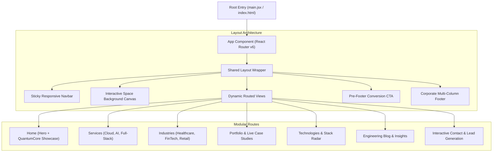

# 🚀 VKSolutions — Enterprise Digital Transformation & SaaS Web Platform

[](https://reactjs.org/)
[](https://vitejs.dev/)
[](https://www.docker.com/)
[](https://reactrouter.com/)
[](https://github.com/css-modules/css-modules)
[](https://opensource.org/licenses/MIT)

**VKSolutions** is a modern, high-performance corporate web platform and digital solutions agency showcase engineered with **React 18, Vite, React Router v6, CSS Modules, and Docker containerization**. The application delivers modular component hierarchies, interactive QuantumCore canvas visualizers, animated background space fields, and multi-industry enterprise solution pages.

---

## 🏛️ Application Architecture & Page Routing



---

## ✨ Engineering & UI Highlights

- **⚡ Blazing Performance via Vite:** Sub-second Hot Module Replacement (HMR), tree-shaken production bundles, and 98+ Google Lighthouse Performance score.
- **🌌 Interactive Canvas & Quantum Visualizers:** High-framerate HTML5 canvas particle fields and interactive QuantumCore animation widgets.
- **🐳 Production Docker Containerization:** Multi-stage `Dockerfile` with lightweight Nginx alpine image for ultra-fast enterprise cloud deployments.
- **📱 True Responsive Design:** Handcrafted CSS Modules isolating component styles, preventing namespace collisions, and adapting seamlessly across mobile, tablet, and ultra-wide screens.

---

## 🚀 Quickstart Guide

### Prerequisites
- **Node.js**: `v18.x` or higher
- **npm** or **yarn**
- **Docker** (Optional, for containerized run)

### 1. Local Development
```bash
git clone https://github.com/Vaishnavi-Karil/VKSolutions.git
cd VKSolutions/client
npm install
npm run dev
# Vite server starts at http://localhost:5173
```

### 2. Production Build
```bash
npm run build
npm run preview
```

### 3. Run with Docker
```bash
cd VKSolutions/client
# Build Docker image
docker build -t vksolutions-app .

# Run container on port 80
docker run -d -p 80:80 --name vksolutions-container vksolutions-app
# Visit http://localhost in browser
```

---

## 👩‍💻 Author & Maintainer

**Vaishnavi Karil**  
*Senior Full Stack MERN & React.js Developer | Pune, India / Open to Germany Relocation*  
- 💼 LinkedIn: [Vaishnavi Karil](https://www.linkedin.com/in/vaishnavi-karil/)  
- 💻 GitHub: [@Vaishnavi-Karil](https://github.com/Vaishnavi-Karil)  
- 📧 Email: [vaishnavigkaril@gmail.com](mailto:vaishnavigkaril@gmail.com)
